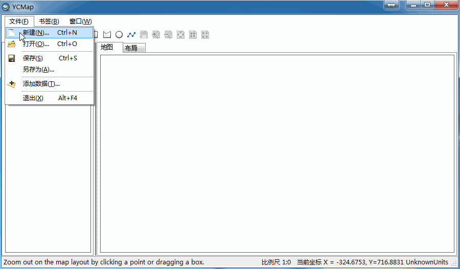
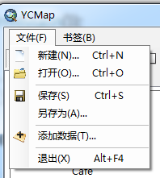
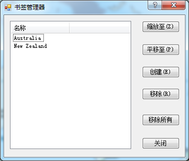

# YCMap
a teaching map demo using ArcGIS Engine and C#

##开发环境
1. 实验环境；安装好ArcGIS Engine10.2, IDE使用Visual studio 2012；
2. 低版本AE需要重新引用AE的reference，更改框架等步骤；低版本IDE需要更改.sln文件，更改成VS2010或其他能打开；

##已实现的功能
1. 文件菜单，新建、打开、保存、另存为地图文档、添加数据、退出功能
2. 书签加载、书签添加功能、书签管理功能
3. mapcontrol与pagelayoutcontrol控件同步
4. 状态栏信息添加
5. 鹰眼实现
6. 右键菜单实现

##TODO
1. 图层符号选择器实现
2. 属性数据表查询显示
3. 简单的空间分析
4. 截图与打印以及导出为PDF

##主要参考
1. [ArcGIS Engine+C#实例开发教程（这个教程比较老了）](http://www.gissky.net/Article/1554.htm)
2. [ArcGIS Object SDK help](http://desktop.arcgis.com/en/arcobjects/latest/net/webframe.htm)
3. ArcGIS Desktop Help