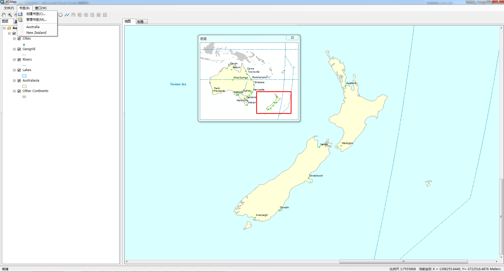
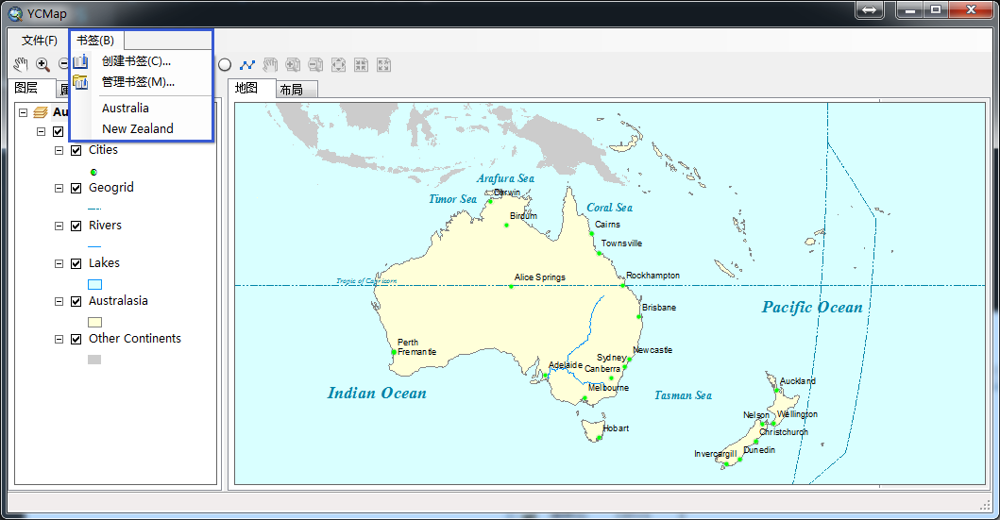

# YCMap
a teaching map demo using ArcGIS Engine and C#

##已实现的功能
1. 文件菜单，新建、打开、保存、另存为地图文档、添加数据、退出功能
2. 书签加载、书签添加功能、书签功能
3. mapcontrol与pagelayoutcontrol控件同步

##TODO
1. 状态栏信息添加
2. 鹰眼实现
3. 右键菜单实现
4. 图层符号选择器实现
5. 属性数据表查询显示
6. 简单的空间分析
7. 截图与打印以及导出为PDF
